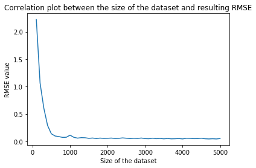
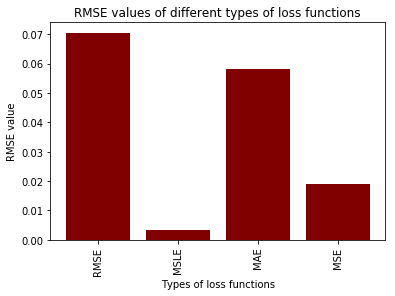
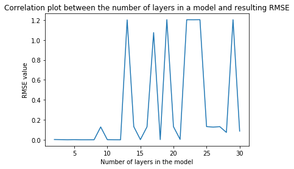

# ROBT 403 Lab Assignments
## Lab Assignment 3 - Part 1 - Joint movement of the planar robot
**TASK:** Create a rosnode that will “listen” for std_msgs/Float64 type data and “publish” this data to the joint of the planar robot. The node should send the command to move if the any new incoming value is lower than the previous one.
## Video Demo 1


https://user-images.githubusercontent.com/52815976/135121698-a484a2d1-5b12-42b4-84dc-bbe4429f0d98.mp4

## Lab Assignment 3 - Part 2 - Step and sine wave response of the planar robot
**TASK:** 

II) Get the step response of (you can create a node that will send a square-wave function): 
  1.the joint at the base of the robot
  2.the joint at the end-effector of the robot
  
III) Get the sine-wave response of (you can create a node that will send a sine-wave function): 
  3.the joint at the base of the robot
  4.the joint at the end-effector of the robot
  
## Video Demo 2


https://user-images.githubusercontent.com/52815976/135628921-3c76a758-85ec-49fc-86f1-319f04e6b99a.mp4

## RQT sine wave and step response Screenshots
### Sine-wave end-effector response graph

### Sine-wave base joint response graph

### Step end-effector response graph

### Step base joint response graph


## Lab Assignment 4
**TASK I**: Configure MoveIt library - **moveit_403 folder**

**Task II**: Create a node moves the “end” by 1.4 (in rviz units mm or m) along X axis - **/test_403/Lab4_2.cpp**


https://user-images.githubusercontent.com/52815976/135878145-db115e73-a28d-4c08-ac2e-39fef04f5d6e.mp4


**TASK III**: Create a node that moves “end” to Draw a rectangle - **/test_403/Lab4_3.cpp**


https://user-images.githubusercontent.com/52815976/135878198-f426c2a7-21f1-4123-9b68-fdeec0e387d0.mp4


**TASK IV**: Create a node that moves “end” to Draw a circle - **/test_403/Lab4_4.cpp**


https://user-images.githubusercontent.com/52815976/135878211-0779c5a1-81a3-4501-9c37-ae0b2237def7.mp4

## Lab Assignment 5
**TASK I**: Aquire data from the joint angles during a rectangle trajectory execution using RosBag and plot them in MatLAB:


**TASK I**: Write a script to reate a node for publishing data of the end-effector's X,Y positions during a rectangle trajectory execution using RosBag and plot them in MatLAB(test_403/publish_js.cpp):


__________________________________________________________________________________________________________________________
## Lab Assignment 6 - Jupyter Notebook report (Improved performance results at the end)
Importing required libraries
```python
import numpy as np 
import keras
from keras.models import Sequential
from keras.layers import Dense, Flatten, Dropout
from keras.optimizers import Adam
from keras.utils import np_utils 
from keras import backend as K 
import pandas as pd
from sklearn.model_selection import train_test_split
import matplotlib.pyplot as plt
```

## 1. Trying different dataset sizes
Importing data from the .csv file


```python
data = pd.read_csv("dict1.csv", header = None, names = ["Angles", "XY"])
```


```python
data.head(10)
```


<div>
<style scoped>
    .dataframe tbody tr th:only-of-type {
        vertical-align: middle;
    }

    .dataframe tbody tr th {
        vertical-align: top;
    }

    .dataframe thead th {
        text-align: right;
    }
</style>
<table border="1" class="dataframe">
  <thead>
    <tr style="text-align: right;">
      <th></th>
      <th>Angles</th>
      <th>XY</th>
    </tr>
  </thead>
  <tbody>
    <tr>
      <th>0</th>
      <td>-0.40510000000000002, -0.097100000000000006, -...</td>
      <td>3.5048 0.9169 0.25</td>
    </tr>
    <tr>
      <th>1</th>
      <td>-0.19320000000000001, 0.1341, -0.2646999999999...</td>
      <td>3.6347 0.3976 0.25</td>
    </tr>
    <tr>
      <th>2</th>
      <td>0.192, 0.155, -0.28570000000000001, -0.3931999...</td>
      <td>3.1567 -1.6357 0.25</td>
    </tr>
    <tr>
      <th>3</th>
      <td>0.24679999999999999, -0.18140000000000001, 0.1...</td>
      <td>3.2989 -1.5492 0.25</td>
    </tr>
    <tr>
      <th>4</th>
      <td>-0.35449999999999998, 0.3926, 0.1613, 0.078299...</td>
      <td>3.6155 -0.2022 0.25</td>
    </tr>
    <tr>
      <th>5</th>
      <td>0.31819999999999998, -0.22770000000000001, -0....</td>
      <td>3.6511 -0.3356 0.25</td>
    </tr>
    <tr>
      <th>6</th>
      <td>0.4531, 0.085400000000000004, 0.4546, 0.098799...</td>
      <td>3.4324 0.4782 0.25</td>
    </tr>
    <tr>
      <th>7</th>
      <td>0.1404, -0.065500000000000003, -0.084099999999...</td>
      <td>3.6861 0.241 0.25</td>
    </tr>
    <tr>
      <th>8</th>
      <td>0.34379999999999999, 0.27279999999999999, -0.4...</td>
      <td>3.1972 -1.6062 0.25</td>
    </tr>
    <tr>
      <th>9</th>
      <td>0.21460000000000001, -0.1293, -0.0403999999999...</td>
      <td>3.6256 0.3925 0.25</td>
    </tr>
  </tbody>
</table>
</div>


Establishing labels and observations


```python
train = data['Angles'].to_numpy()
labels = data['XY'].to_numpy()
```

Formatting of the data to the computer-readable format and dividing into training and testing sets


```python
X = list()
Y = list()
for i in range(len(train)):
    labels[i] = labels[i].replace('   ', ' ')
    labels[i] = labels[i].replace('  ', ' ')
    labels[i] = labels[i].strip('[ ').strip(' ]')
    train[i] = train[i].strip('(').strip(')')
    result = [float(val) for val in train[i].split(',')]
    X.append(result)
    result = [float(val) for val in labels[i].split(' ')]
    Y.append(result)
```

Defining RMS error function


```python
def rmse(y_true, y_pred):
    return K.sqrt(K.mean(K.square(y_pred - y_true)))

model = Sequential()
model.add(Dense(10, input_dim =5, activation = 'relu'))
model.add(Dense(16, activation = 'relu'))
model.add(Dense(2, activation='linear'))
model.compile(loss=rmse, optimizer=Adam(0.01))
```

Looping through experiments with a different size of a dataset


```python
test_size_rmse = []
n = range(100, 5100, 100)
for i in range(1,51):
    X_train, X_test, y_train, y_test = train_test_split(np.asarray(X[0:i*100]), np.asarray(Y[0:i*100]), test_size=0.80)
    y_train = np.delete(y_train, 2, 1)
    y_test = np.delete(y_test, 2, 1)
    model.fit(X_train, y_train, epochs = 10, verbose = 0)
    scores = model.evaluate(X_test, y_test, verbose=0) 
    test_size_rmse.append(scores)
```

Plotting correlation data


```python
plt.plot(n,test_size_rmse)
plt.xlabel("Size of the dataset")
plt.ylabel("RMSE value")
plt.title("Correlation plot between the size of the dataset and resulting RMSE")
plt.show()
```





**Considering those results we take the whole datatset consisting of 5000 observations**

## 2. Trying different losses
a) MSLE - Mean Squared Logarithmic Error


```python
model = Sequential()
model.add(Dense(10, input_dim =5, activation = 'relu'))
model.add(Dense(16, activation = 'relu'))
model.add(Dense(2, activation='linear'))
model.compile(loss='mean_squared_logarithmic_error', optimizer=Adam(0.01))

X_train, X_test, y_train, y_test = train_test_split(np.asarray(X), np.asarray(Y), test_size=0.80)
y_train = np.delete(y_train, 2, 1)
y_test = np.delete(y_test, 2, 1)
model.fit(X_train, y_train, epochs = 10, verbose = 0)
scores_msle = model.evaluate(X_test, y_test, verbose=0) 
print("RMSE: %.5f" % (scores_msle))
```

    RMSE: 0.00349


b) MAE - Mean Absolute Error


```python
model = Sequential()
model.add(Dense(10, input_dim =5, activation = 'relu'))
model.add(Dense(16, activation = 'relu'))
model.add(Dense(2, activation='linear'))
model.compile(loss='mean_absolute_error', optimizer=Adam(0.01))

X_train, X_test, y_train, y_test = train_test_split(np.asarray(X), np.asarray(Y), test_size=0.80)
y_train = np.delete(y_train, 2, 1)
y_test = np.delete(y_test, 2, 1)
model.fit(X_train, y_train, epochs = 10, verbose = 0)
scores_mae = model.evaluate(X_test, y_test, verbose=0) 
print("RMSE: %.5f" % (scores_mae))
```

    RMSE: 0.05830


c) MSE - Mean Squared Error


```python
model = Sequential()
model.add(Dense(10, input_dim =5, activation = 'relu'))
model.add(Dense(16, activation = 'relu'))
model.add(Dense(2, activation='linear'))
model.compile(loss='mean_squared_error', optimizer=Adam(0.01))

X_train, X_test, y_train, y_test = train_test_split(np.asarray(X), np.asarray(Y), test_size=0.80)
y_train = np.delete(y_train, 2, 1)
y_test = np.delete(y_test, 2, 1)
model.fit(X_train, y_train, epochs = 10, verbose = 0)
scores_mse = model.evaluate(X_test, y_test, verbose=0) 
print("RMSE: %.5f" % (scores_mse))
```

    RMSE: 0.01906


d) Regular RMSE


```python
def rmse(y_true, y_pred):
    return K.sqrt(K.mean(K.square(y_pred - y_true)))

model = Sequential()
model.add(Dense(10, input_dim =5, activation = 'relu'))
model.add(Dense(16, activation = 'relu'))
model.add(Dense(2, activation='linear'))
model.compile(loss=rmse, optimizer=Adam(0.01))

X_train, X_test, y_train, y_test = train_test_split(np.asarray(X), np.asarray(Y), test_size=0.80)
y_train = np.delete(y_train, 2, 1)
y_test = np.delete(y_test, 2, 1)
model.fit(X_train, y_train, epochs = 10, verbose = 0)
scores = model.evaluate(X_test, y_test, verbose=0) 
print("RMSE: %.5f" % (scores))
```

    RMSE: 0.07049


Bar plot for comparison


```python
error_names = ['RMSE','MSLE','MAE','MSE']
errors = [scores, scores_msle, scores_mae, scores_mse]

plt.bar(range(len(error_names)), errors, color = 'maroon')
plt.xticks(range(len(error_names)), error_names, rotation='vertical')
plt.xlabel("Types of loss functions")
plt.ylabel("RMSE value")
plt.title("RMSE values of different types of loss functions")
plt.show()
```





**Considering the results of this testing we use MSLE in order to further improve out results**

## 3. Testing different number of layers
Loopint through the outcomes with the different number of layers


```python
layers_scores = []

for i in range(1,30):
    model = Sequential()
    numb = 0
    model.add(Dense(10, input_dim =5, activation = 'relu'))
    numb += 1
    for r in range(1,i):
        model.add(Dense(16, activation = 'relu'))
        numb += 1
    model.add(Dense(2, activation='linear'))
    numb += 1
    model.compile(loss='mean_squared_logarithmic_error', optimizer=Adam(0.01))

    X_train, X_test, y_train, y_test = train_test_split(np.asarray(X), np.asarray(Y), test_size=0.80)
    y_train = np.delete(y_train, 2, 1)
    y_test = np.delete(y_test, 2, 1)
    model.fit(X_train, y_train, epochs = 10, verbose = 0)
    score = model.evaluate(X_test, y_test, verbose=0) 
    print("Numer of layers: %d |   RMSE: %.5f" % (numb, score))
    layers_scores.append(score)
```

    Numer of layers: 2 |   RMSE: 0.00310
    Numer of layers: 3 |   RMSE: 0.00211
    Numer of layers: 4 |   RMSE: 0.00085
    Numer of layers: 5 |   RMSE: 0.00199
    Numer of layers: 6 |   RMSE: 0.00067
    Numer of layers: 7 |   RMSE: 0.00073
    Numer of layers: 8 |   RMSE: 0.00087
    Numer of layers: 9 |   RMSE: 0.12890
    Numer of layers: 10 |   RMSE: 0.00170
    Numer of layers: 11 |   RMSE: 0.00095
    Numer of layers: 12 |   RMSE: 0.00062
    Numer of layers: 13 |   RMSE: 1.20081
    Numer of layers: 14 |   RMSE: 0.13224
    Numer of layers: 15 |   RMSE: 0.00222
    Numer of layers: 16 |   RMSE: 0.13028
    Numer of layers: 17 |   RMSE: 1.07331
    Numer of layers: 18 |   RMSE: 0.00237
    Numer of layers: 19 |   RMSE: 1.20336
    Numer of layers: 20 |   RMSE: 0.13197
    Numer of layers: 21 |   RMSE: 0.00449
    Numer of layers: 22 |   RMSE: 1.20201
    Numer of layers: 23 |   RMSE: 1.20167
    Numer of layers: 24 |   RMSE: 1.20249
    Numer of layers: 25 |   RMSE: 0.13238
    Numer of layers: 26 |   RMSE: 0.12754
    Numer of layers: 27 |   RMSE: 0.13191
    Numer of layers: 28 |   RMSE: 0.07431
    Numer of layers: 29 |   RMSE: 1.20234
    Numer of layers: 30 |   RMSE: 0.08709


Plotting the resulting correlation graph


```python
numb_arr = range(2,31)

plt.plot(numb_arr,layers_scores)
plt.xlabel("Number of layers in the model")
plt.ylabel("RMSE value")
plt.title("Correlation plot between the number of layers in a model and resulting RMSE")
plt.show()
```





**Therefore, the number of layers I'm going to use further is 4 layers**

## 5. Testing different optimizers
a) "Adam"


```python
model = Sequential()
model.add(Dense(10, input_dim =5, activation = 'relu'))
model.add(Dense(16, activation = 'relu'))
model.add(Dense(16, activation = 'relu'))
model.add(Dense(2, activation='linear'))
model.compile(loss='mean_squared_logarithmic_error', optimizer=Adam(0.01))

X_train, X_test, y_train, y_test = train_test_split(np.asarray(X), np.asarray(Y), test_size=0.80)
y_train = np.delete(y_train, 2, 1)
y_test = np.delete(y_test, 2, 1)
model.fit(X_train, y_train, epochs = 10, verbose = 0)
scores_adam = model.evaluate(X_test, y_test, verbose=0) 
print("RMSE: %.5f" % (scores_adam))
```

    RMSE: 0.00121


b) "SGD"


```python
model = Sequential()
model.add(Dense(10, input_dim =5, activation = 'relu'))
model.add(Dense(16, activation = 'relu'))
model.add(Dense(16, activation = 'relu'))
model.add(Dense(2, activation='linear'))
model.compile(loss='mean_squared_logarithmic_error', optimizer='sgd')

X_train, X_test, y_train, y_test = train_test_split(np.asarray(X), np.asarray(Y), test_size=0.80)
y_train = np.delete(y_train, 2, 1)
y_test = np.delete(y_test, 2, 1)
model.fit(X_train, y_train, epochs = 10, verbose = 0)
scores_adam = model.evaluate(X_test, y_test, verbose=0) 
print("RMSE: %.5f" % (scores_adam))
```

    RMSE: 0.07395


c) "Adagrad"


```python
model = Sequential()
model.add(Dense(10, input_dim =5, activation = 'relu'))
model.add(Dense(16, activation = 'relu'))
model.add(Dense(16, activation = 'relu'))
model.add(Dense(2, activation='linear'))
model.compile(loss='mean_squared_logarithmic_error', optimizer='Adagrad')

X_train, X_test, y_train, y_test = train_test_split(np.asarray(X), np.asarray(Y), test_size=0.80)
y_train = np.delete(y_train, 2, 1)
y_test = np.delete(y_test, 2, 1)
model.fit(X_train, y_train, epochs = 10, verbose = 0)
scores_adam = model.evaluate(X_test, y_test, verbose=0) 
print("RMSE: %.5f" % (scores_adam))
```

    RMSE: 0.01524


d) "Adadelta"


```python
model = Sequential()
model.add(Dense(10, input_dim =5, activation = 'relu'))
model.add(Dense(16, activation = 'relu'))
model.add(Dense(16, activation = 'relu'))
model.add(Dense(2, activation='linear'))
model.compile(loss='mean_squared_logarithmic_error', optimizer='Adadelta')

X_train, X_test, y_train, y_test = train_test_split(np.asarray(X), np.asarray(Y), test_size=0.80)
y_train = np.delete(y_train, 2, 1)
y_test = np.delete(y_test, 2, 1)
model.fit(X_train, y_train, epochs = 10, verbose = 0)
scores_adam = model.evaluate(X_test, y_test, verbose=0) 
print("RMSE: %.5f" % (scores_adam))
```

    RMSE: 0.01023


e) "RMSprop"


```python
model = Sequential()
model.add(Dense(10, input_dim =5, activation = 'relu'))
model.add(Dense(16, activation = 'relu'))
model.add(Dense(16, activation = 'relu'))
model.add(Dense(2, activation='linear'))
model.compile(loss='mean_squared_logarithmic_error', optimizer='RMSprop')

X_train, X_test, y_train, y_test = train_test_split(np.asarray(X), np.asarray(Y), test_size=0.80)
y_train = np.delete(y_train, 2, 1)
y_test = np.delete(y_test, 2, 1)
model.fit(X_train, y_train, epochs = 10, verbose = 0)
scores_adam = model.evaluate(X_test, y_test, verbose=0) 
print("RMSE: %.5f" % (scores_adam))
```

    RMSE: 0.13256


**The best optimizer so far belongs to "Adam" in this case**

# Final Performance:
### Old RMSE = 0.07 |     New RMSE = 0.001
### Used properties: 
Data-set of 5000 observations <br>
Loss function: MSLE - Mean Squared Logarithmic Error<br>
Number of layers: 6<br>
Numberof nodes in each layer: 70<br>
