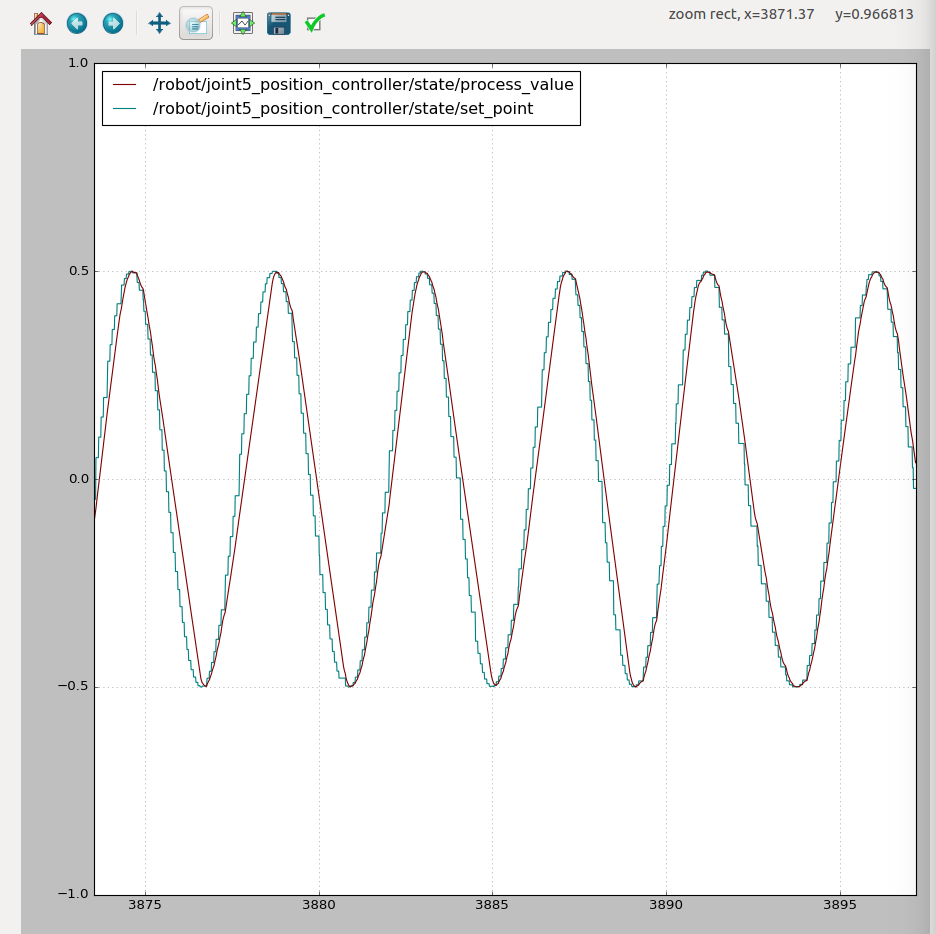
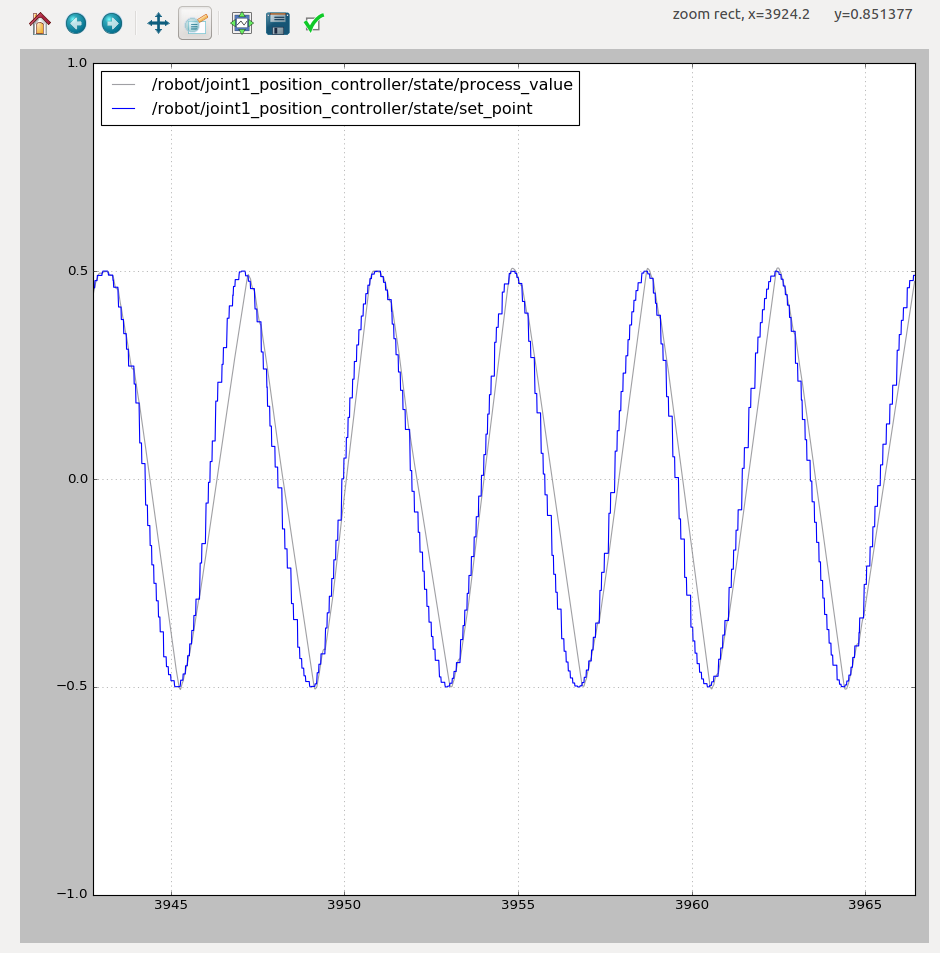
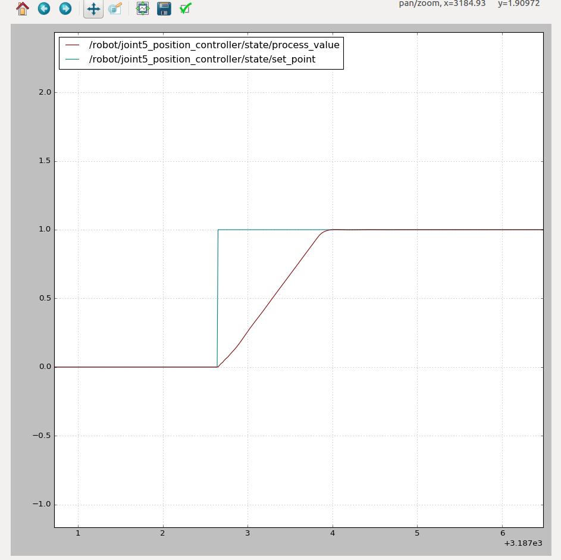
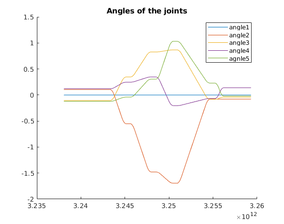
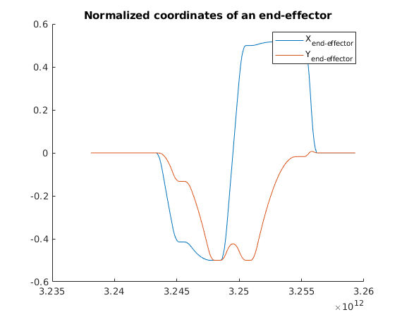
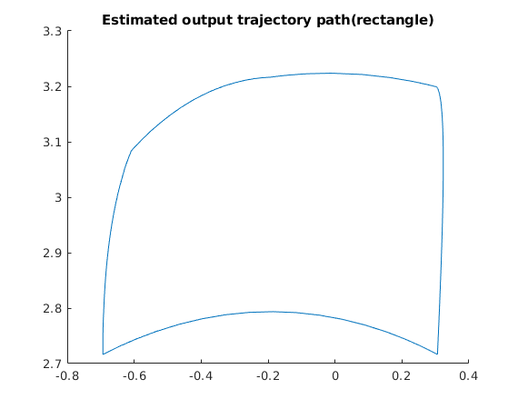

# ROBT 403 Lab Assignments
## Lab Assignment 3 - Part 1 - Joint movement of the planar robot
**TASK:** Create a rosnode that will “listen” for std_msgs/Float64 type data and “publish” this data to the joint of the planar robot. The node should send the command to move if the any new incoming value is lower than the previous one.
## Video Demo 1

https://user-images.githubusercontent.com/52815976/135121698-a484a2d1-5b12-42b4-84dc-bbe4429f0d98.mp4

## Lab Assignment 3 - Part 2 - Step and sine wave response of the planar robot
**TASK:** 

II) Get the step response of (you can create a node that will send a square-wave function): 
  1.the joint at the base of the robot
  2.the joint at the end-effector of the robot
  
III) Get the sine-wave response of (you can create a node that will send a sine-wave function): 
  3.the joint at the base of the robot
  4.the joint at the end-effector of the robot
  
## Video Demo 2

https://user-images.githubusercontent.com/52815976/135628921-3c76a758-85ec-49fc-86f1-319f04e6b99a.mp4

## RQT sine wave and step response Screenshots
### Sine-wave end-effector response graph

### Sine-wave base joint response graph

### Step end-effector response graph

### Step base joint response graph

## Lab Assignment 4
**TASK I**: Configure MoveIt library - **moveit_403 folder**

**Task II**: Create a node moves the “end” by 1.4 (in rviz units mm or m) along X axis - **/test_403/Lab4_2.cpp**

https://user-images.githubusercontent.com/52815976/135878145-db115e73-a28d-4c08-ac2e-39fef04f5d6e.mp4

**TASK III**: Create a node that moves “end” to Draw a rectangle - **/test_403/Lab4_3.cpp**

https://user-images.githubusercontent.com/52815976/135878198-f426c2a7-21f1-4123-9b68-fdeec0e387d0.mp4

**TASK IV**: Create a node that moves “end” to Draw a circle - **/test_403/Lab4_4.cpp**

https://user-images.githubusercontent.com/52815976/135878211-0779c5a1-81a3-4501-9c37-ae0b2237def7.mp4

## Lab Assignment 5
**TASK I**: Aquire data from the joint angles during a rectangle trajectory execution using RosBag and plot them in MatLAB:

**TASK I**: Write a script to reate a node for publishing data of the end-effector's X,Y positions during a rectangle trajectory execution using RosBag and plot them in MatLAB(test_403/publish_js.cpp):

